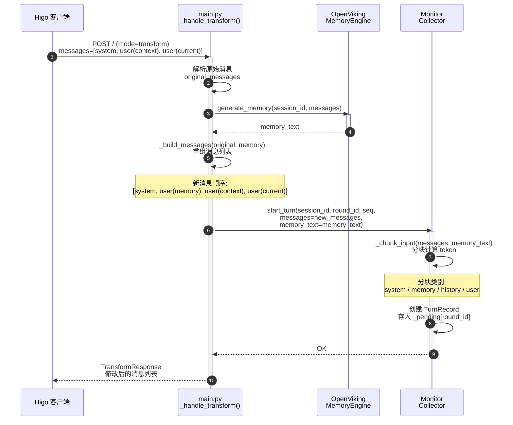
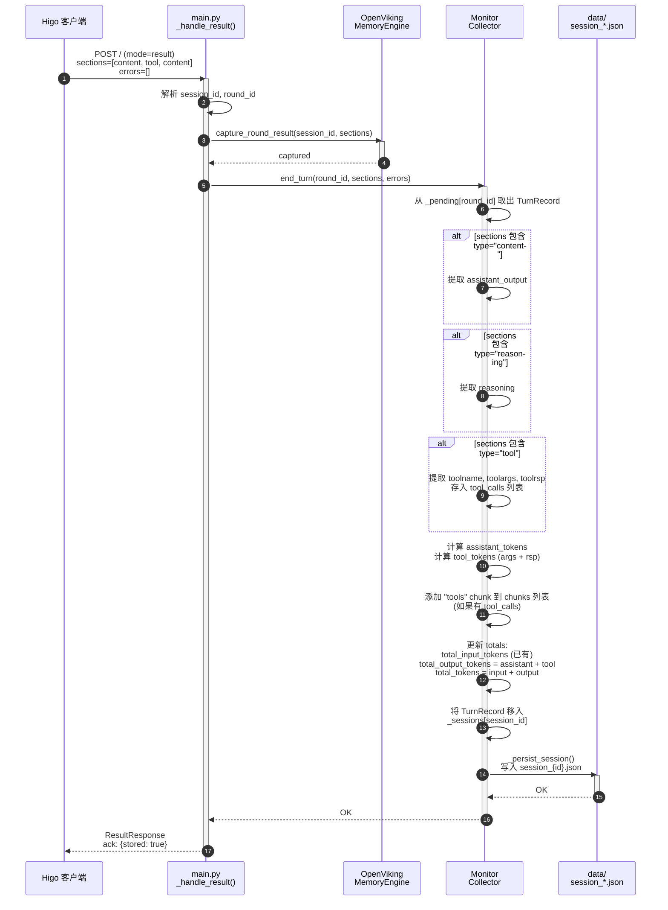
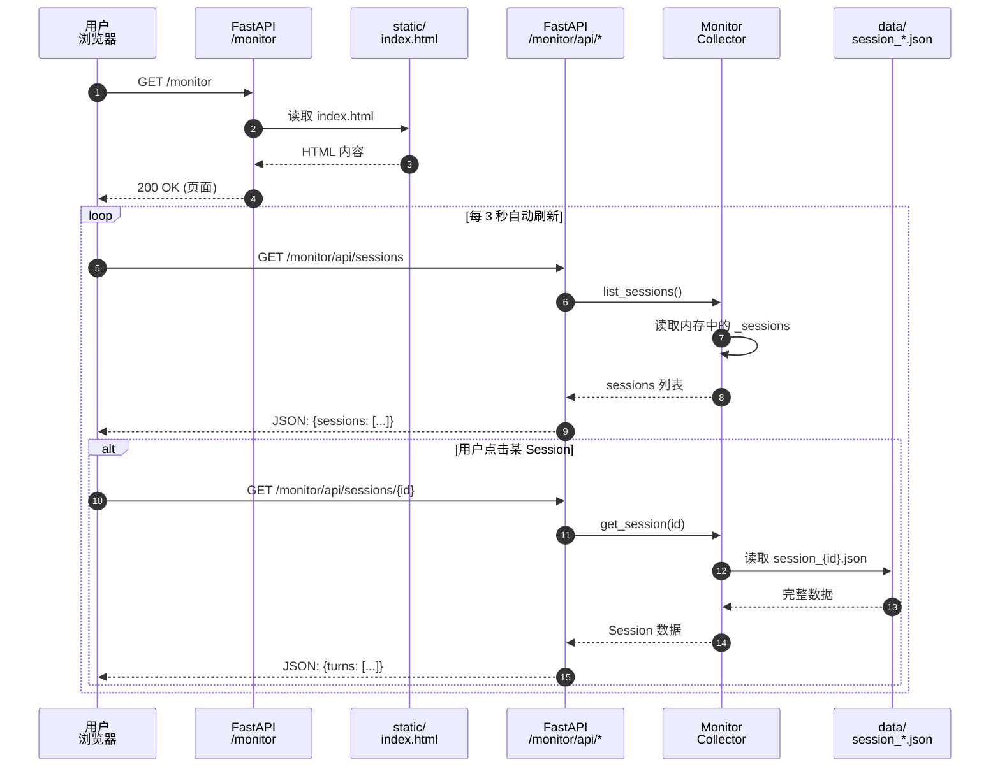

# Higo2OV Monitor 监控功能时序图

本文档基于当前代码实现，描述 Higo2OV 监控功能从数据收集到页面展示的完整流程。

---

## 1. 整体架构

```
+------------------+     transform      +------------------+     result       +------------------+
|                  | ------------------>|                  |----------------->|                  |
|   Higo 客户端     |  (原始消息)         |   higo2ov        |  (sections/     |   Monitor        |
|   (业务通信)      | <------------------|   main.py        |   errors)        |   Collector      |
|                  |   (修改后的消息)     |   POST /         |                  |   (数据收集)      |
+------------------+                     +------------------|                  +--------+---------+
       ^                                          |                                   |
       |                                          | mount_monitor(app)                | Session 文件
       |                                          | 注册 /monitor/* 路由               | (data/session_*.json)
       |                                          v                                   v
       |                                   +------------------+                  +-------------+
       |                                   |   FastAPI        |                  |   data/      |
       |                                   |   Router         |                  |   持久化目录  |
       |                                   |   /monitor       |                  +-------------+
       |                                   +------------------|
       |                                          ^
       |                                          |
       |         GET /monitor                     |
       |         GET /monitor/api/*               |
       |                                          |
+------------------+                               |
|                  |                               |
|   用户浏览器      |-------------------------------|
|   (监控查看)      |
|                  |
+------------------+
```

**通信关系说明：**
- **Higo 客户端 ↔ higo2ov**：仅通过 `POST /` 进行业务通信（transform / result / probe）
- **用户浏览器 ↔ higo2ov**：直接访问 `GET /monitor` 和 `GET /monitor/api/*` 查看监控数据
- **Monitor Collector**：内部模块，接收 main.py 的埋点数据，写入 data/ 目录

---

## 2. Transform 阶段时序

当 Higo 客户端发送 transform 请求时，higo2ov 处理流程如下：



### Transform 阶段关键点

| 步骤 | 说明 |
|------|------|
| 1 | Higo 发送原始消息列表，包含 system + context + current user |
| 2 | higo2ov 调用 memory engine 生成 memory 文本 |
| 3 | `_build_messages()` 重组消息，将 memory 注入到第一个 user 消息之前 |
| 4 | **关键**：`start_turn()` 在重组**之后**调用，传入的是**包含 memory 的完整消息列表** |
| 5 | Collector 对重组后的消息进行分块，计算各分块 token 数 |
| 6 | TurnRecord 创建并暂存到 `_pending`（等待 result 回调） |

---

## 3. Result 阶段时序

当 LLM 完成回复后，Higo 发送 result 回调，higo2ov 处理流程如下：



### Result 阶段关键点

| 步骤 | 说明 |
|------|------|
| 1 | Higo 发送 result 回调，包含 LLM 回复的 sections |
| 2 | higo2ov 先将 sections 中的 assistant/tool 内容存入 OpenViking |
| 3 | `end_turn()` 从 `_pending` 中取出之前暂存的 TurnRecord |
| 4 | 解析 sections，提取 `type="content"` 的文本作为 assistant_output |
| 5 | 提取 `type="reasoning"` 的思考过程 |
| 6 | 提取 `type="tool"` 的 tool 调用信息（name/args/rsp） |
| 7 | 计算 assistant_output 的 token 数 + tool 参数/结果的 token 数 |
| 8 | 如果有 tool_calls，在 chunks 列表中追加 "tools" 分块 |
| 9 | 更新 totals，将完整 TurnRecord 存入内存和磁盘 |

---

## 4. 页面展示时序

**用户主动打开浏览器**访问监控页面时的数据流：



---

## 5. 数据模型流转

### 单轮对话数据生命周期

```
┌─────────────────────────────────────────────────────────────┐
│                     TurnRecord (单轮)                        │
├─────────────────────────────────────────────────────────────┤
│  基本信息                                                     │
│  ├── turn_id: "turn_a1b2c3d4"                                │
│  ├── session_id: "abc123"                                    │
│  ├── round_id: "rnd_xxx"                                     │
│  └── seq: 5                                                  │
├─────────────────────────────────────────────────────────────┤
│  Input (transform 阶段记录)                                   │
│  ├── system_prompt / system_tokens                           │
│  ├── memory_injected / memory_tokens                         │
│  ├── conversation_history / history_tokens                   │
│  └── user_input / user_tokens                                │
├─────────────────────────────────────────────────────────────┤
│  Output (result 阶段记录)                                     │
│  ├── assistant_output / assistant_tokens                     │
│  ├── reasoning                                               │
│  └── tool_calls[] (toolname, toolargs, toolrsp)              │
├─────────────────────────────────────────────────────────────┤
│  Chunks (供饼图展示)                                          │
│  ├── {category: "system", tokens: 25}                        │
│  ├── {category: "memory", tokens: 28}                        │
│  ├── {category: "history", tokens: 45}                       │
│  ├── {category: "user", tokens: 14}                          │
│  └── {category: "tools", tokens: 120}  ← 有 tool 时追加      │
├─────────────────────────────────────────────────────────────┤
│  Totals                                                      │
│  ├── total_input_tokens: 112                                 │
│  ├── total_output_tokens: 156                                │
│  └── total_tokens: 268                                       │
└─────────────────────────────────────────────────────────────┘
```

---

## 6. Token 计算流程

```mermaid
flowchart TD
    A[transform 请求到达] --> B{重组消息<br/>_build_messages}
    B --> C[_chunk_input 分块]
    C --> D{tiktoken 编码?}
    D -->|是| E[cl100k_base 精确计算]
    D -->|否| F[字符估算<br/>CJK=1, ASCII=0.25]
    E --> G[生成 chunks 数组]
    F --> G
    G --> H[汇总 total_input_tokens]

    I[result 回调到达] --> J[提取 assistant_output]
    J --> K[_count_tokens]
    K --> L[assistant_tokens]

    I --> M{有 tool_calls?}
    M -->|是| N[计算 toolargs tokens]
    M -->|是| O[计算 toolrsp tokens]
    N --> P[tool_tokens]
    O --> P
    P --> Q[追加 "tools" chunk]
    Q --> R[total_output_tokens<br/>= assistant + tool]

    M -->|否| R
    L --> R

    H --> S[total_tokens<br/>= input + output]
    R --> S
```

---

## 7. Session 文件持久化流程

```mermaid
sequenceDiagram
    autonumber
    participant Collector as TurnCollector
    participant Memory as 内存<br/>_sessions[session_id]
    participant File as data/<br/>session_{id}.json

    Collector->>Memory: 追加新 TurnRecord
    Collector->>Collector: _persist_session(session_id)

    Collector->>File: 写入完整 Session 数据
    Note over File: {
      "session_id": "abc123",
      "turns": [TurnRecord, ...],
      "session_totals": {...}
    }

    Collector->>Memory: _load_history() (启动时)
    File-->>Memory: 读取 session_*.json
    Memory->>Memory: 每 Session 保留最近 50 轮
```

---

## 8. 关键时序总结

| 阶段 | 触发者 | 触发时机 | 核心操作 | 数据流向 |
|------|--------|---------|---------|---------|
| **Transform** | Higo 客户端 | 用户发送消息 | 生成 memory、重组消息 | Higo → main.py → Collector.start_turn() |
| **Result** | Higo 客户端 | LLM 回复完成 | 提取输出、计算 token、持久化 | Higo → main.py → Collector.end_turn() → data/ |
| **展示** | **用户浏览器** | 用户主动访问 /monitor | 加载 Session 数据、渲染图表 | Browser → FastAPI → Collector → data/ |
