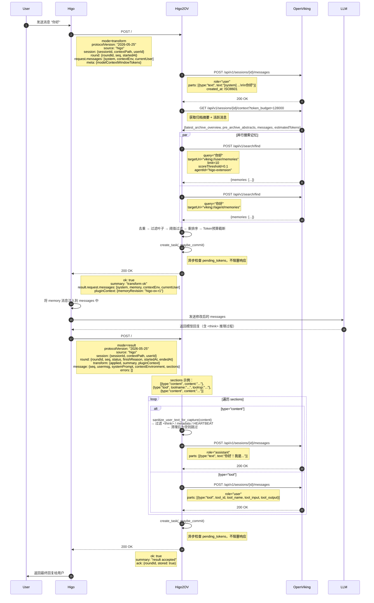

# Higo2OV 交互时序图

## 场景：一个完整的 Round（用户发消息 → 模型回复）

---

## 关键说明

### Transform 阶段（Round 开始）

| 步骤 | 动作 | OV API |
|------|------|--------|
| 1 | Capture user 输入 | `POST /api/v1/sessions/{id}/messages` |
| 2 | 获取 session 上下文 | `GET /api/v1/sessions/{id}/context` |
| 3 | 搜索相关记忆（并行） | `POST /api/v1/search/find` × 2 |
| 4 | 异步检查并触发归档 | `GET /api/v1/sessions/{id}` → `POST /api/v1/sessions/{id}/commit` |

**响应关键**：`result.request.messages` 必须保留 system/contextEnv/currentUser 的相对顺序，最后一条 user 必须是 currentUser。

### Result 阶段（Round 结束）

| 步骤 | 动作 | OV API |
|------|------|--------|
| 1 | 解析 sections，提取 assistant 文本 | 本地处理 |
| 2 | 清洗（过滤 think/metadata/HEARTBEAT） | `sanitize_user_text_for_capture()` |
| 3 | 空内容跳过，否则存入 assistant 回复 | `POST /api/v1/sessions/{id}/messages` (role=assistant) |
| 4 | 存入 tool 结果 | `POST /api/v1/sessions/{id}/messages` (role=user, type=tool) |
| 5 | 异步检查并触发归档 | `GET /api/v1/sessions/{id}` → `POST /api/v1/sessions/{id}/commit` |

**幂等性**：`capture_round_result` 以 `roundId` 为键做去重，同一 roundId 重复调用不会重复写入。

### Memory Query 阶段（独立调用）

`mode=memory_query` 提供记忆查询工具能力，当前为**占位实现**。

| action | 说明 | 当前行为 |
|--------|------|---------|
| `help` | 返回查询语法帮助 | 返回 `ok=false, summary="当前功能不可用，暂不支持"` |
| `query` | 执行记忆查询 | 同上 |

### 异步归档（_maybe_commit）

Transform 和 Result 阶段都会异步触发 `_maybe_commit`：
- 获取 session 的 `pending_tokens`
- 如果超过 `commitTokenThreshold`，调用 `commit(wait=false)`
- OV 返回 `task_id`，Phase 2（记忆提取）异步执行
