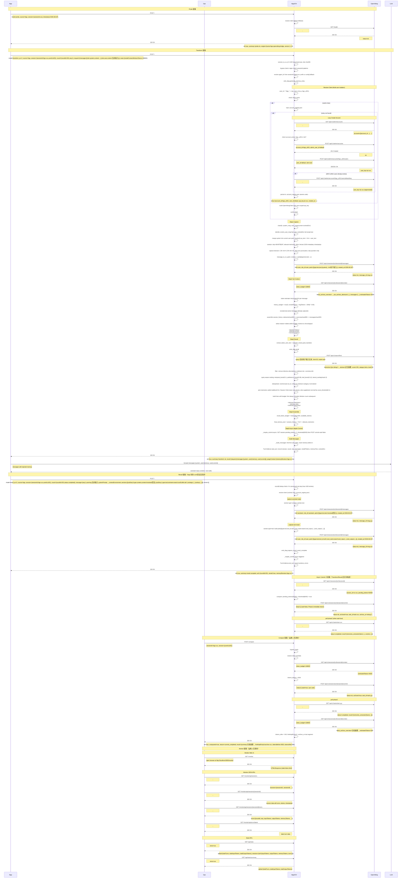

# Higo2OV 完整时序图

## 参与者说明

- **Higo**：宿主客户端，负责调用插件进行消息转换和结果回调
- **Ops**：运维人员，通过外部 HTTP 调用 compact 和监控接口
- **Higo2OV**：本插件（FastAPI 服务）
- **OpenViking**：OV 后端记忆服务
- **LLM**：大模型

## Mermaid 时序图


```mermaid
sequenceDiagram
    participant H as Higo
    participant Ops as Ops
    participant P as Higo2OV
    participant OV as OpenViking
    participant L as LLM

    %% ============ Probe ============
    Note over H,OV: Probe 链路
    H->>P: POST /
    Note right of H: mode=probe, source=higo, session={sessionId:xxx}, timestamp=2026-06-04T...
    P->>P: resolve client (admin fallback)
    P->>OV: GET /health
    Note right of P: -
    OV-->>P: 200 OK
    Note left of OV: status=ok
    P-->>H: 200 OK
    Note left of P: ok=true, summary=probe ok, engine={name:higo-openviking-bridge, version:1.1.0}

    %% ============ Transform ============
    Note over H,L: Transform 链路
    H->>P: POST /
    Note right of H: mode=transform, pv=2, source=higo, session={sessionId:higo-xxx,userId:u001}, round={roundId:r001,seq:1}, request={messages:[{role:system,content:...},{role:user,content:当前输入}]}, meta={modelContextWindowTokens:128000}

    P->>P: session_to_ov_id: UUID keep lowercase, else sha256
    P->>P: bypass check: regex match sessionId patterns
    P->>P: resolve agent_id: from sessionId agent:xxx: prefix or config fallback
    P->>P: emit_diag generate_memory_entry

    Note over P,OV: Resolve Client (Multi-user Isolation)
    P->>P: user_id = "higo_" + raw_user_id (e.g. higo_u001)
    P->>P: check client cache

    alt cache miss
        P->>P: load .account_registry.json

        alt entry not found
            Note over P,OV: Lazy Create Account
            P->>OV: GET /api/v1/admin/accounts
            Note right of P: -
            OV-->>P: 200 OK
            Note left of OV: accounts=[{account_id:...}, ...]
            P->>P: check account_exists: higo_u001 in list?

            P->>OV: POST /api/v1/admin/accounts
            Note right of P: account_id=higo_u001, admin_user_id=default
            OV-->>P: 201 Created
            Note left of OV: ok

            P->>OV: POST /api/v1/admin/accounts/higo_u001/users
            Note right of P: user_id=default, role=user
            OV-->>P: 200/201 OK
            Note left of OV: user_key=uk-xxx

            alt 409 Conflict (user already exists)
                P->>OV: POST /api/v1/admin/accounts/higo_u001/users/default/key
                Note right of P: -
                OV-->>P: 200 OK
                Note left of OV: user_key=uk-xxx (regenerated)
            end

            P->>P: persist to .account_registry.json (atomic write)
            Note over P: entry={account_id:higo_u001, user_id:default, api_key:uk-xxx, created_at:...}
        end

        P->>P: build OpenVikingClient with user-scoped api_key
        P->>P: cache client
    end

    Note over P: Step1 Capture
    P->>P: classify: system_msg, user_msgs(current+contextEnv)
    P->>P: identify current_user_msg=last user, contextEnv=all except last
    P->>P: merge system into current user parts: [system] sys_text + \n\n + user_text
    P->>P: sanitize: strip HEARTBEAT, relevant-memories, think, fenced JSON metadata, timestamps
    P->>P: capture decision: CJK min=0, EN min=10, skip pure punctuation, skip question-only
    P->>P: message_to_ov_parts: content -> parts[{type:text,text:...}]

    P->>OV: POST /api/v1/sessions/{ovSessionId}/messages
    Note right of P: role=user, role_id=user, parts=[{type:text,text:[system]...\n\n用户输入}], created_at=2026-06-04T...
    OV-->>P: 200 OK
    Note left of OV: status=ok, message_id=msg-xxx

    Note over P: Step2 Get Context
    P->>OV: GET /api/v1/sessions/{ovSessionId}/context
    Note right of P: token_budget=128000
    OV-->>P: 200 OK
    Note left of OV: latest_archive_overview=..., pre_archive_abstracts=[...], messages=[...], estimatedTokens=4500

    P->>P: token estimate: len(content)//4 per message
    P->>P: history_budget = max(0, (modelTokens - msgTokens - 2048) * 0.85)
    P->>P: exclude last active message (already captured)
    P->>P: assemble session_history: abstracts(max800) -> overview(max800) -> messages(max500)
    P->>P: select newest->oldest within budget, reverse to chronological
    P->>P: wrap: <session-history> selected_entries </session-history>

    Note over P: Step3 Recall
    P->>P: extract_latest_user_text -> prepare_recall_query (sanitize)
    P->>P: emit_diag recall

    P->>OV: POST /api/v1/search/find
    Note right of P: query=当前用户输入文本, limit=20, mode=auto
    OV-->>P: 200 OK
    Note left of OV: memories=[{uri:viking://..., abstract:记忆摘要, score:0.95, category:facts, level:2}]

    P->>P: filter: remove directory descriptions (.abstract.md, .overview.md)
    P->>P: query-aware ranking: temporal_boost(0.1), preference_boost(0.08), leaf_boost(0.12), lexical_overlap(max0.2)
    P->>P: deduplicate: events/cases by uri, others by abstract+category+normalized
    P->>P: pick memories: prefer leaf(level=2), if leaves>=limit return only leaves, else supplement non-leaf by score_threshold(0.1)
    P->>P: build lines with budget: first always included, tiktoken count subsequent
    P->>P: wrap: <relevant-memories> memory_lines </relevant-memories>

    Note over P: Step4 Assemble
    P->>P: recall_token_budget = min(config:2000, available_tokens)
    P->>P: final_memory_text = session_history + "\n\n" + relevant_memories

    Note over P: Step5 Async Maybe Commit
    P->>P: _maybe_commit async: GET session pending_tokens, if > threshold(8000) then POST commit wait=false

    Note over P: Build Messages
    P->>P: _build_messages: find first user index, insert memory before it
    P->>P: TurnCollector.start_turn: record session, round, seq, messages, modelTokens, memoryText, contextEnv

    P-->>H: 200 OK
    Note left of P: ok=true, summary=transform ok, result={request:{messages:[system, user(memory), user(current)]}, pluginContext={memoryRevision:higo-ov-r1}}

    H->>L: forward messages [system, user(memory), user(current)]
    Note right of H: messages with injected memory
    L-->>H: assistant reply (content + tool calls)

    %% ============ Result ============
    Note over H,OV: Result 链路（Higo 拿到 LLM 回复后回调）
    H->>P: POST /
    Note right of H: mode=result, pv=2, source=higo, session={sessionId:higo-xxx,userId:u001}, round={roundId:r001,status:completed}, message={seq:1,usermsg:当前输入,systemPrompt:...,contextEnvironment:,sections:[{subSeq:0,type:content,content:Assistant回复},{subSeq:1,type:tool,toolname:search,toolCallId:call-1,toolargs:{...},toolrsp:{...}}]}, errors=[]

    P->>P: roundId dedup check: if in processed set skip (max 1000 entries)
    P->>P: resolve client (cached, from .account_registry.json)

    Note over P: capture assistant reply
    P->>P: section type=content: sanitize text
    P->>OV: POST /api/v1/sessions/{ovSessionId}/messages
    Note right of P: role=assistant, role_id=assistant, parts=[{type:text,text:Assistant回复}], created_at=2026-06-04T...
    OV-->>P: 200 OK
    Note left of OV: status=ok, message_id=msg-yyy

    Note over P: capture tool result
    P->>P: section type=tool: build parts[{type:tool,tool_id:call-1,tool_name:search,tool_input:{...},tool_output:{...}}]
    P->>OV: POST /api/v1/sessions/{ovSessionId}/messages
    Note right of P: role=user, role_id=user, parts=[{type:tool,tool_id:call-1,tool_name:search,tool_input:{...},tool_output:{...}}], created_at=2026-06-04T...
    OV-->>P: 200 OK
    Note left of OV: status=ok, message_id=msg-zzz

    P->>P: emit_diag capture_round_result_complete
    P->>P: _maybe_commit async triggered
    P->>P: TurnCollector.end_turn: record sections, errors

    P-->>H: 200 OK
    Note left of P: ok=true, summary=result accepted, ack={roundId:r001, stored=true, memoryRevision:higo-ov-r1}

    %% ============ Async Commit Detail ============
    Note over P,OV: Async Commit 子链路（Transform/Result 后异步触发）
    P->>OV: GET /api/v1/sessions/{ovSessionId}
    Note right of P: -
    OV-->>P: 200 OK
    Note left of OV: session_id=ov-xxx, pending_tokens=50000

    P->>P: compare: pending_tokens(50000) > threshold(8000) = true
    P->>OV: POST /api/v1/sessions/{ovSessionId}/commit
    Note right of P: body={} (wait=false, Phase1 immediate return)
    OV-->>P: 200 OK
    Note left of OV: status=ok, archived=true, task_id=task-xxx, archive_uri=viking://...

    Note over P,OV: poll phase2 (when wait=true)
    P->>OV: GET /api/v1/tasks/task-xxx
    Note right of P: -
    OV-->>P: 200 OK
    Note left of OV: status=completed, result={memories_extracted:{facts:[...], events:[...]}}

    %% ============ Compact ============
    Note over Ops,OV: Compact 链路（运维人员调用）
    Ops->>P: POST /compact
    Note right of Ops: sessionId=higo-xxx, session={userId:u001}

    P->>P: bypass check
    P->>P: resolve client (cached)
    P->>OV: GET /api/v1/sessions/{ovSessionId}/context
    Note right of P: token_budget=128000
    OV-->>P: 200 OK
    Note left of OV: estimatedTokens=4500
    P->>P: tokens_before = 4500

    P->>OV: POST /api/v1/sessions/{ovSessionId}/commit
    Note right of P: body={} (wait=true, sync wait)
    OV-->>P: 200 OK
    Note left of OV: status=ok, archived=true, task_id=task-yyy

    Note over P,OV: poll phase2
    P->>OV: GET /api/v1/tasks/task-yyy
    Note right of P: -
    OV-->>P: 200 OK
    Note left of OV: status=completed, result={memories_extracted:{facts:[...]}}

    P->>OV: GET /api/v1/sessions/{ovSessionId}/context
    Note right of P: token_budget=128000
    OV-->>P: 200 OK
    Note left of OV: latest_archive_overview=归档摘要..., estimatedTokens=500
    P->>P: tokens_after = 500, firstKeptEntryId = archive_uri last segment

    P-->>Ops: 200 OK
    Note left of P: ok=true, compacted=true, reason=commit_completed, result={summary:归档摘要..., firstKeptEntryId:archive-xxx, tokensBefore:4500, tokensAfter:500}

    %% ============ Monitor APIs ============
    Note over Ops,P: Monitor 链路（运维人员调用）

    Note over Ops,P: Monitor Web UI
    Ops->>P: GET /monitor
    Note right of Ops: open browser at http://localhost:8000/monitor
    P-->>Ops: 200 OK
    Note left of P: HTMLResponse (static/index.html)

    Note over Ops,P: Monitor JSON APIs
    Ops->>P: GET /monitor/api/sessions
    Note right of Ops: -
    P-->>Ops: 200 OK
    Note left of P: sessions=[sessionId1, sessionId2, ...]

    Ops->>P: GET /monitor/api/sessions/{sessionId}
    Note right of Ops: -
    P-->>Ops: 200 OK
    Note left of P: session data with turns, tokens, timestamps

    Ops->>P: GET /monitor/api/sessions/{sessionId}/turns
    Note right of Ops: -
    P-->>Ops: 200 OK
    Note left of P: turns=[{roundId, seq, inputTokens, outputTokens, memoryTokens, ...}]

    Ops->>P: GET /monitor/api/turns/latest
    Note right of Ops: -
    P-->>Ops: 200 OK
    Note left of P: latest turn data

    Note over Ops,P: Stats APIs
    Ops->>P: GET /api/stats
    Note right of Ops: since=xxx
    P-->>Ops: 200 OK
    Note left of P: global={totalTurns, totalInputTokens, totalOutputTokens}, sessions={sid={inputTokens, outputTokens, memoryTokens, turns:[]}}

    Ops->>P: GET /api/stats/summary
    Note right of Ops: since=xxx
    P-->>Ops: 200 OK
    Note left of P: global={totalTurns, totalInputTokens, totalOutputTokens}
```

---

## 各链路功能详解

### Probe 链路
- 触发时机：Higo 启动/心跳时
- 参与者：Higo -> Higo2OV -> OpenViking
- 功能：检查插件自身和 OV 后端连通性
- 关键 API：`GET /health`

### Transform 链路（核心链路）
- 触发时机：每轮用户输入时
- 参与者：Higo -> Higo2OV -> OpenViking -> Higo -> LLM
- 内部逻辑：
  1. **Session ID 映射**：`session_to_ov_id` — UUID 直接保留（小写），非 UUID 做 sha256
  2. **Bypass 检查**：正则匹配 sessionId，命中则跳过
  3. **Agent 解析**：从 `sessionId` 的 `agent:xxx:` 前缀提取，或 fallback 到 config
  4. **Diagnostics**：`emit_diag` 在各阶段发射诊断事件
  5. **多用户隔离（Resolve Client）**：
     - `user_id = "higo_" + raw_user_id`（如 higo_u001）
     - 检查 client cache（内存缓存）
     - cache miss → 加载 `.account_registry.json`
     - registry 中无 entry → **懒创建**：
       - `GET /api/v1/admin/accounts` 查询已有 accounts
       - `POST /api/v1/admin/accounts` 创建 account（account_id=higo_u001）
       - `POST /api/v1/admin/accounts/{id}/users` 注册 user（user_id=default, role=user）
       - 409 Conflict 时 → `POST /users/{user_id}/key` regenerate key
       - 原子写入 `.account_registry.json`
     - 用 user_key 构建独立的 `OpenVikingClient`
  6. **消息分类**：system / user(current) / user(contextEnv)，system 合并到 current user 的 parts 中
  7. **Sanitize**：过滤 HEARTBEAT、strip `<relevant-memories>`、strip `<think>`、strip fenced JSON metadata、strip 时间戳前缀、去空字符、折叠空白
  8. **Capture 决策**：CJK 最短长度 0、英文最短 10、跳过纯标点、跳过纯问句（带 memory intent 除外）
  9. **History Budget 计算**：`max(0, (model_context_tokens - messages_tokens - 2048) * 0.85)`，token 估算 `len(content) // 4`
  10. **Session History 组装**：pre_archive_abstracts(截断800) + latest_overview(截断800) + active_messages(去掉最后一个，截断500)，从新到旧选取不超 budget，包装 `<session-history>`
  11. **Recall Query**：从最后一条 user 消息提取文本，sanitize 后作为搜索 query
  12. **Memory 搜索**：`POST /api/v1/search/find`，mode=auto，limit=20
  13. **Memory 后处理**：
      - 过滤 directory descriptions（.abstract.md / .overview.md）
      - Query-aware ranking：temporal boost(0.1) + preference boost(0.08) + leaf boost(0.12) + lexical overlap boost(max0.2)
      - 去重：events/cases 按 uri，其他按 abstract+category+normalized_text
      - 选择：优先 leaf(level=2)，不足时补 non-leaf（按 score_threshold=0.1 过滤）
  14. **Memory Budget 组装**：`build_memory_lines_with_budget` — 第一条强制包含，后续按 tiktoken 计数，包装 `<relevant-memories>`
  15. **Recall Token Budget**：`min(config.recall_token_budget=2000, available_tokens)`
  16. **最终组装**：`session_history + "\n\n" + relevant_memories`
  17. **消息重构**：`_build_messages` — 在第一个 user 消息前插入 memory（顺序：system → user(memory) → user(contextEnv) → user(current)）
  18. **Monitor**：`TurnCollector.start_turn` 记录每轮输入 token、memory token、context env
  19. **Async Commit**：`_maybe_commit` 异步检查 pending_tokens，超过 threshold(8000) 触发归档
- 关键 API：`POST /messages`, `GET /context`, `POST /search/find`

### Result 链路
- 触发时机：Higo 拿到 LLM 回复后回调
- 参与者：Higo -> Higo2OV -> OpenViking
- 内部逻辑：
  1. **RoundId 去重**：set 最多 1000 条，避免重复捕获
  2. **Resolve Client**：从 cache / `.account_registry.json` 获取（通常已创建）
  3. **Assistant 捕获**：section type=content → sanitize → POST /messages role=assistant
  4. **Tool 捕获**：section type=tool → 构建 parts[{type:tool, tool_id, tool_name, tool_input, tool_output}] → POST /messages role=user
  5. **Async Commit**：触发 _maybe_commit
  6. **Monitor**：`TurnCollector.end_turn` 记录输出 sections 和 errors
- 关键 API：`POST /messages`

### Async Commit 子链路
- 触发时机：Transform/Result 后异步
- 参与者：Higo2OV -> OpenViking
- 内部逻辑：
  1. `GET /session` 获取 pending_tokens
  2. 如果 > threshold(8000)：`POST /commit`
  3. wait=false：立即返回 task_id
  4. wait=true：轮询 `GET /tasks/{id}` 直到 completed/failed/timeout（最长 300s）
  5. 完成后 memories_extracted 包含 facts、events 等分类
- 关键 API：`GET /session`, `POST /commit`, `GET /task`

### Compact 链路
- 触发时机：运维人员调用 `POST /compact`
- 参与者：Ops -> Higo2OV -> OpenViking
- 内部逻辑：
  1. Bypass 检查
  2. Resolve Client（从 cache/registry）
  3. 预提交 GET context → tokensBefore
  4. POST commit wait=true（同步等待）
  5. 轮询 Phase 2
  6. 后提交 GET context → tokensAfter、latest_archive_overview
  7. 返回 summary、firstKeptEntryId、tokensBefore/After
- 关键 API：`GET /context`, `POST /commit(wait=true)`, `GET /task`

### Monitor 链路
- 触发时机：运维人员查询
- 参与者：Ops -> Higo2OV
- 功能：
  - `GET /api/stats`：完整统计（含每 session 详情）
  - `GET /api/stats/summary`：轻量统计（仅全局聚合）
- 收集维度：每轮 inputTokens、outputTokens、memoryTokens、modelTokens

---

## 完整调用链总结

```
用户输入
  -> Higo 组装请求 -> Higo2OV Transform
    -> Higo2OV 内部处理（resolve client -> capture -> context -> recall -> assemble）
      -> 新用户时：创建 OV account + USER key -> 持久化 .account_registry.json
    -> Higo2OV 返回注入记忆后的 messages
  -> Higo 转发 messages -> LLM
    -> LLM 生成回复（content + tool calls）
  -> Higo 收到 LLM 回复 -> Higo2OV Result
    -> Higo2OV 捕获 assistant + tool 结果到 OV
    -> Higo2OV 返回 ack
  -> Higo 展示回复给用户

（异步）Higo2OV 持续检查 pending_tokens，超阈值时触发 OV 自动归档

运维人员可随时调用：
  - POST /compact：强制归档会话
  - GET /api/stats：查看完整监控数据
  - GET /api/stats/summary：查看轻量监控数据
```

---

## 配置参数速查

| 参数 | 默认值 | 说明 |
|---|---|---|
| `OPENVIKING_BASE_URL` | `http://127.0.0.1:1933` | OV 后端地址 |
| `OPENVIKING_AGENT_ID` | `default` | 默认 Agent ID |
| `OPENVIKING_TIMEOUT_MS` | `30000` | HTTP 超时 |
| `OPENVIKING_COMMIT_TOKEN_THRESHOLD` | `8000` | 自动归档阈值 |
| `OPENVIKING_RECALL_LIMIT` | `10` | 搜索返回上限 |
| `OPENVIKING_RECALL_SCORE_THRESHOLD` | `0.1` | 记忆分数过滤阈值 |
| `OPENVIKING_RECALL_INJECT_LIMIT` | `6` | 注入记忆条数上限 |
| `OPENVIKING_RECALL_TOKEN_BUDGET` | `2000` | 记忆注入 token 预算 |
| `OPENVIKING_AUTO_CAPTURE` | `true` | 是否自动捕获消息 |
| `OPENVIKING_AUTO_RECALL` | `true` | 是否自动召回记忆 |
| `OPENVIKING_CAPTURE_MAX_LENGTH` | `8192` | 捕获最大长度 |
| `OPENVIKING_BYPASS_SESSION_PATTERNS` | `""` | 跳过 session 的正则模式 |
| `OPENVIKING_EMIT_DIAGNOSTICS` | `true` | 是否发射诊断事件 |
| `OPENVIKING_ISOLATE_AGENT_SCOPE_BY_USER` | `true` | Agent 是否按用户隔离 |
| `OPENVIKING_ISOLATE_USER_SCOPE_BY_AGENT` | `false` | 用户是否按 Agent 隔离 |
